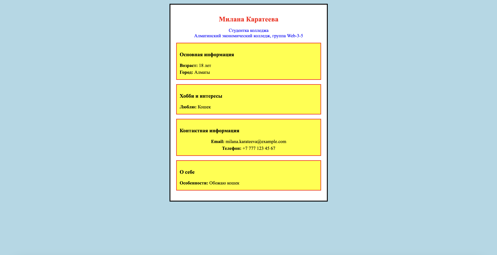

# Основы программирования - Геометрия и Визитка от 3 сентября

Выполнила: Милана Каратеева  
Колледж: Алматинский экономический колледж, группа Web-3-5

### Geometry Calculations
Файл: [python.py](./python.py)


### HTML визитка
Файл: [business_card.html](./business_card.html)


**Онлайн версия визитки:**
[https://codepen.io/Milana-Menschen-Karateeva/pen/bNEvYqg](https://codepen.io/Milana-Menschen-Karateeva/pen/bNEvYqg)

```bash
python ./python.py
```