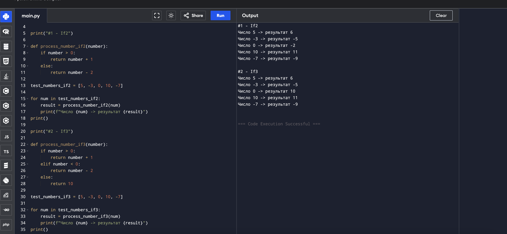

# If2 и If3 от 5 сентября

Выполнила: Милана Каратеева  
Колледж: Алматинский экономический колледж, группа Web-3-5

### If2 и If3
Файл: [conditional.py](if.py)

**Логика заданий:**
- **If2:** Если число положительное → +1, иначе → -2
- **If3:** Если положительное → +1, если отрицательное → -2, если ноль → 10



**Онлайн версия:**
[https://www.programiz.com/online-compiler/3qxjvPQSU5ciQ](https://www.programiz.com/online-compiler/3qxjvPQSU5ciQ)

```bash
python ./if.py
```
