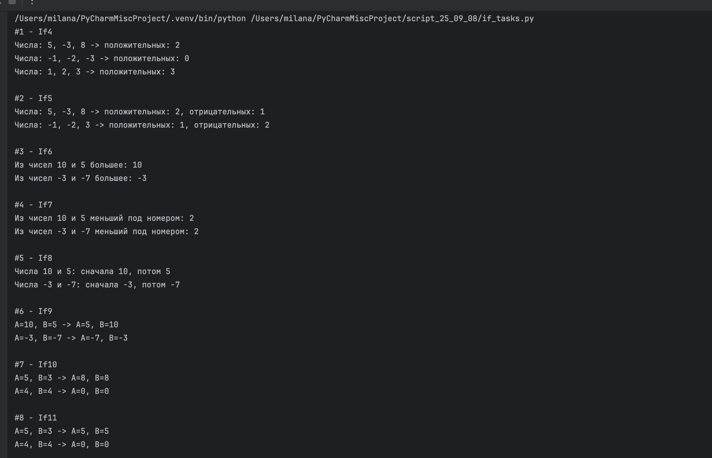
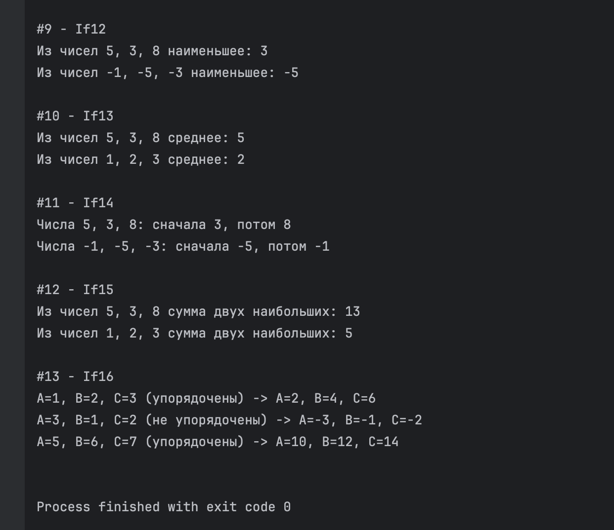

# If4 - If16 от 8 сентября

Выполнила: Милана Каратеева  
Колледж: Алматинский экономический колледж, группа Web-3-5

### If4 - If16
Файл: [if_tasks.py](if_tasks.py)

**Результаты выполнения:**





```bash
python ./if_tasks.py
```
