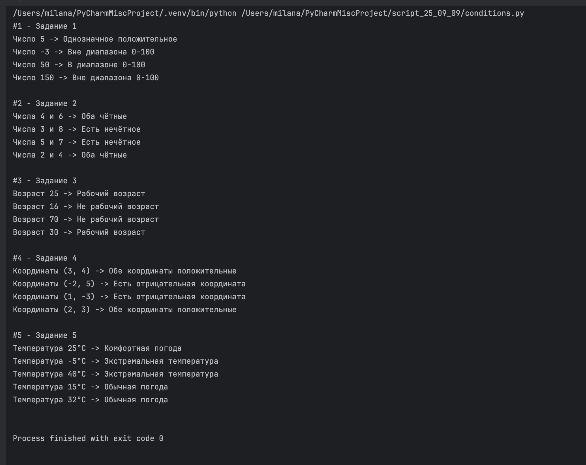

# задагия от 9 сентября

Выполнила: Милана Каратеева  
Колледж: Алматинский экономический колледж, группа Web-3-5

### задагия от 9 сентября
Файл: [conditions.py](conditions.py)



**Онлайн версия:**
[https://www.programiz.com/online-compiler/](https://www.programiz.com/online-compiler/)

```bash
python ./conditions.py
```
