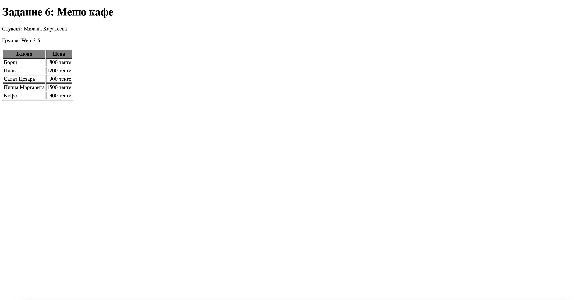
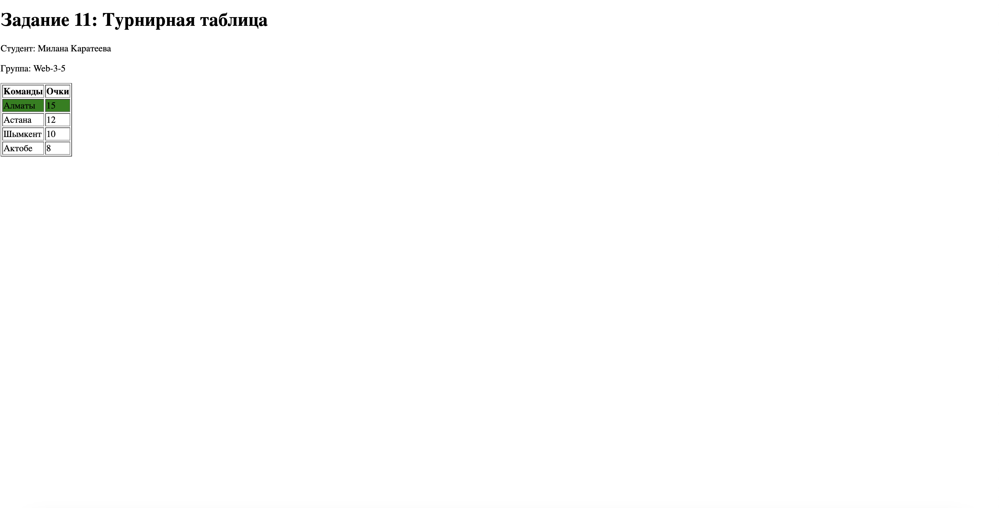

# HTML Таблицы - Задания от 12 сентября

Выполнила: Милана Каратеева  
Колледж: Алматинский экономический колледж, группа Web-3-5

## Задание 1: Простая таблица 2x2
Файл: [task1.html](./task1.html)  
Результат: 

## Задание 2: Стилизация таблицы
Файл: [task2.html](./task2.html)  
Результат: 

## Задание 3: Таблица 3x3 с заголовками
Файл: [task3.html](./task3.html)  
Результат: 

## Задание 4: Таблица с colspan
Файл: [task4.html](./task4.html)  
Результат: 

## Задание 5: Расписание колледжа
Файл: [task5.html](./task5.html)  
Результат: 

## Задание 6: Меню кафе
Файл: [task6.html](./task6.html)  
Результат: 

## Задание 7: Сравнение телефонов
Файл: [task7.html](./task7.html)  
Результат: 

## Задание 8: Топ-5 стран по населению
Файл: [task8.html](./task8.html)  
Результат: 

## Задание 9: Результаты экзаменов
Файл: [task9.html](./task9.html)  
Результат: 

## Задание 10: Финансовый отчёт
Файл: [task10.html](./task10.html)  
Результат: 

## Задание 11: Турнирная таблица
Файл: [task11.html](./task11.html)  
Результат: 

## Задание 12: История заказов
Файл: [task12.html](./task12.html)  
Результат: 

## Задание 13: График дежурств
Файл: [task13.html](./task13.html)  
Результат: 

## Задание 14: Каталог книг
Файл: [task14.html](./task14.html)  
Результат: 

## Задание 15: Календарь на месяц
Файл: [task15.html](./task15.html)  
Результат: 

## Задание 16: Список фильмов
Файл: [task16.html](./task16.html)  
Результат: 

## Задание 17: Цены на авиабилеты
Файл: [task17.html](./task17.html)  
Результат: 

## Задание 18: Интернет тарифы
Файл: [task18.html](./task18.html)  
Результат: 

## Задание 19: Планы подписки
Файл: [task19.html](./task19.html)  
Результат: 

## Задание 20: Успеваемость по предметам
Файл: [task20.html](./task20.html)  
Результат: 

## Задание 21: Рейтинг игроков
Файл: [task21.html](./task21.html)  
Результат: 

## Задание 22: Каталог автомобилей
Файл: [task22.html](./task22.html)  
Результат: 

## Задание 23: Сравнение браузеров
Файл: [task23.html](./task23.html)  
Результат: 

## Задание 24: История Олимпийских игр
Файл: [task24.html](./task24.html)  
Результат: 

## Задание 25: Расходы на путешествие
Файл: [task25.html](./task25.html)  
Результат: 
