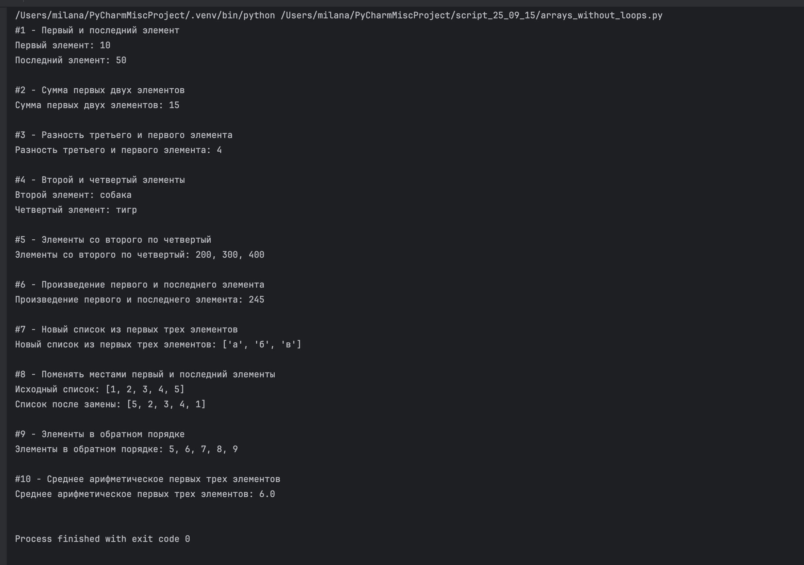
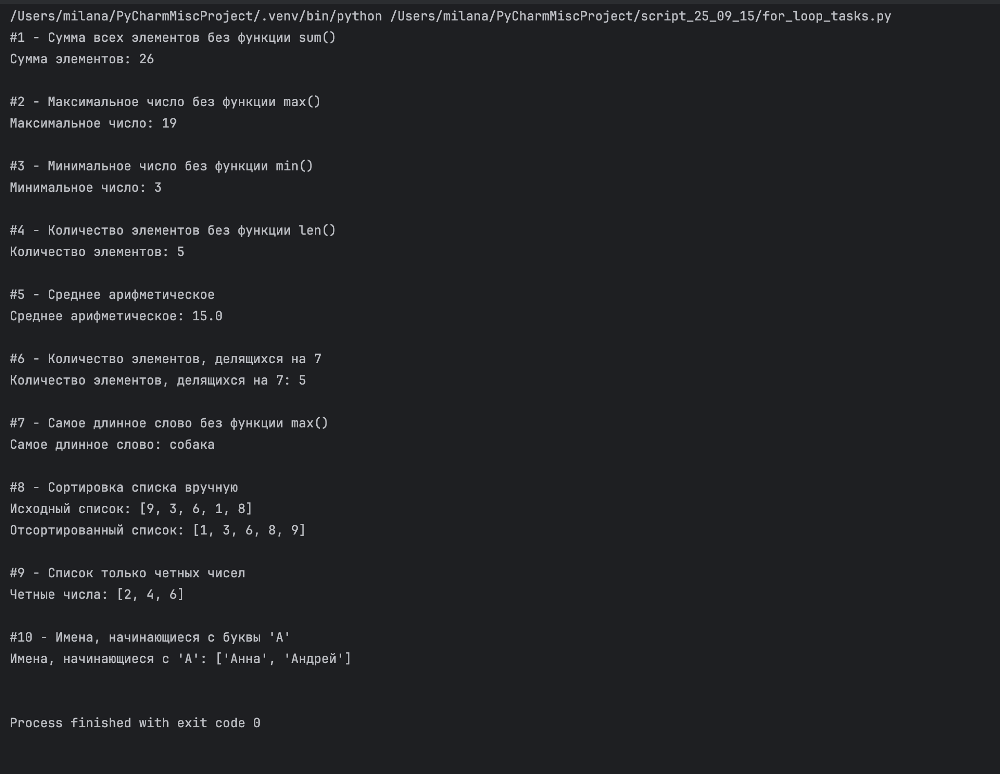

# Массивы и циклы от 15 сентября

Выполнила: Милана Каратеева  
Колледж: Алматинский экономический колледж, группа Web-3-5

### МАССИВЫ БЕЗ ЦИКЛОВ
Файл: [arrays_without_loops.py](arrays_without_loops.py)  
Результат: 

### ЦИКЛ FOR
Файл: [for_loop_tasks.py](for_loop_tasks.py)  
Результат: 


```bash
python ./arrays_without_loops.py
python ./for_loop_tasks.py
```
