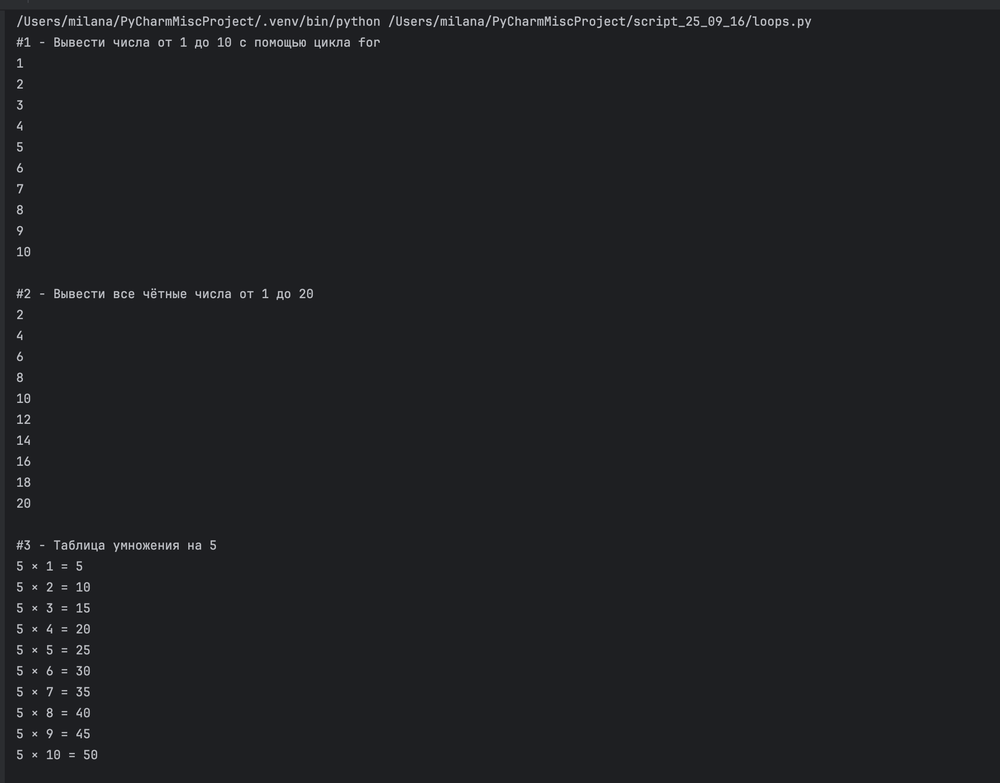
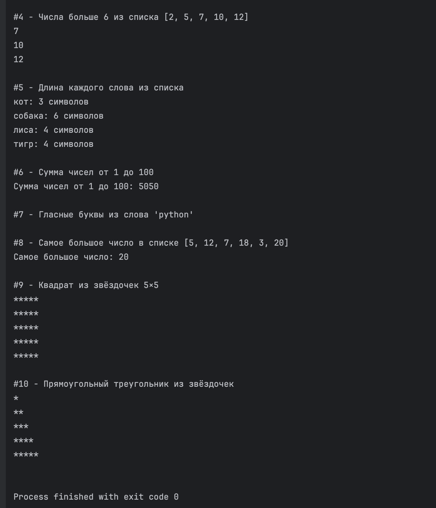
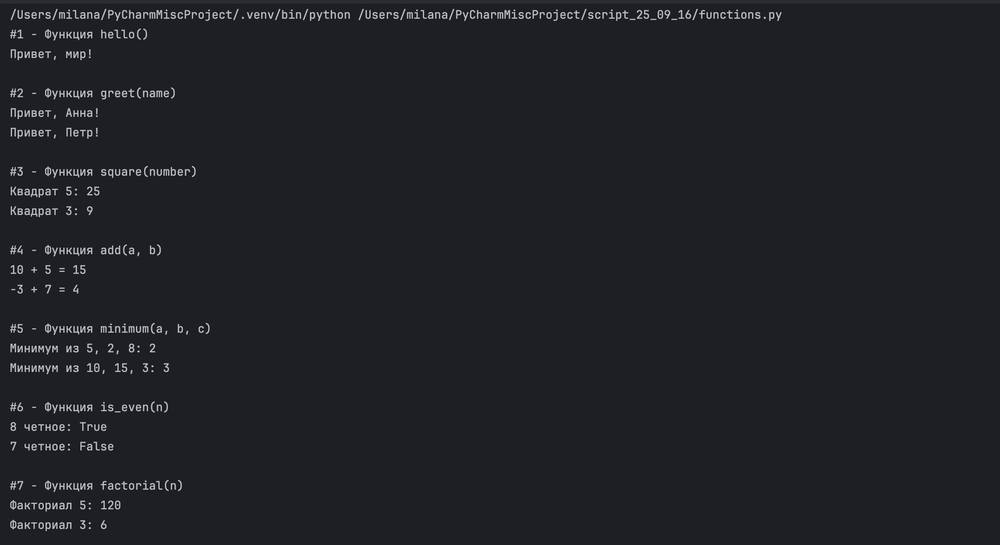
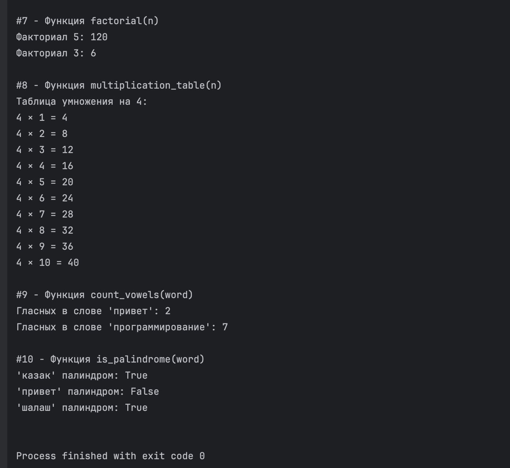

# Циклы и функции от 16 сентября

Выполнила: Милана Каратеева  
Колледж: Алматинский экономический колледж, группа Web-3-5

### ЦИКЛЫ
Файл: [loops.py](loops.py)  
Результат 1:   
Результат 2: 

### ФУНКЦИИ
Файл: [functions.py](functions.py)  
Результат 1:   
Результат 2: 

```bash
python ./loops.py
python ./functions.py
```
