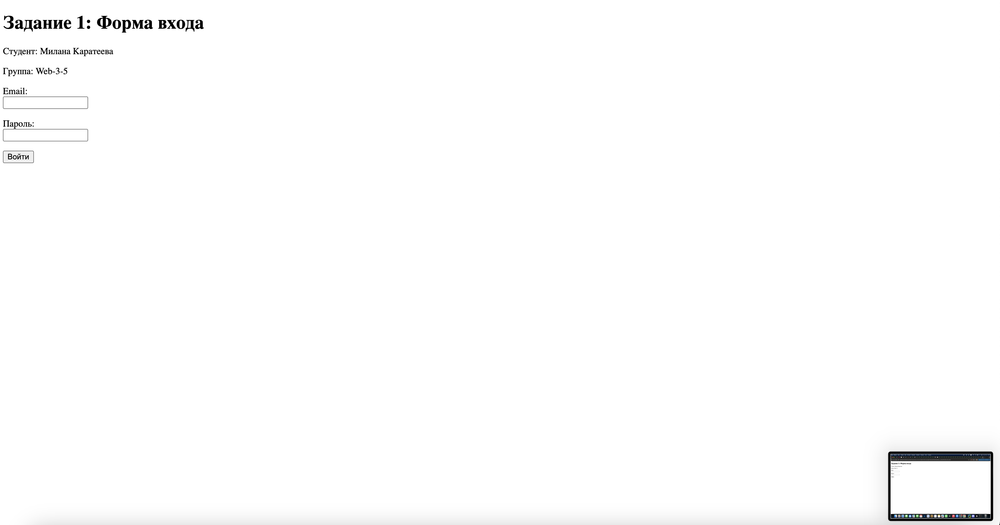
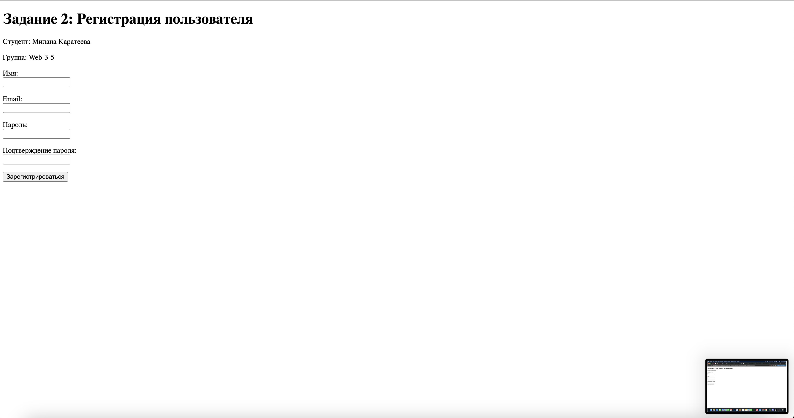
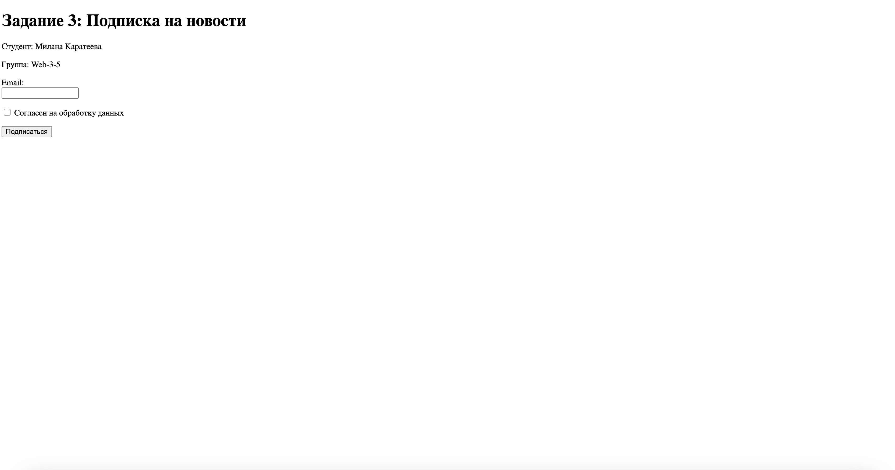
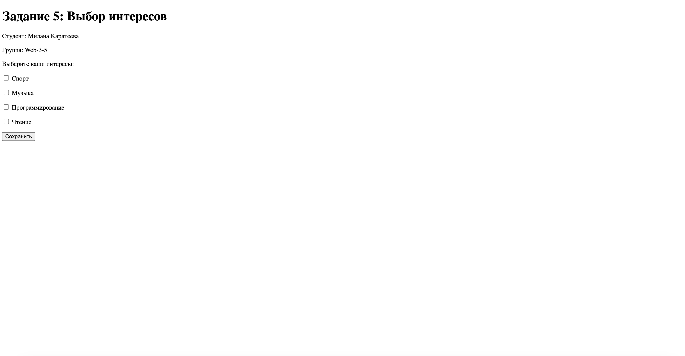
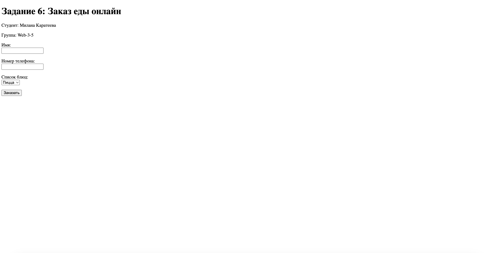
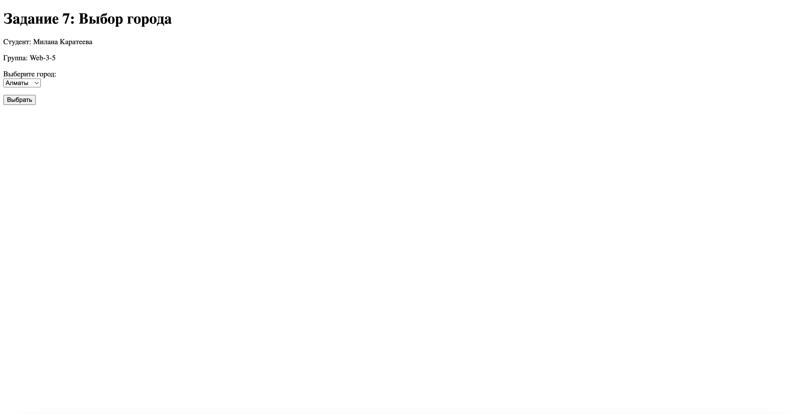
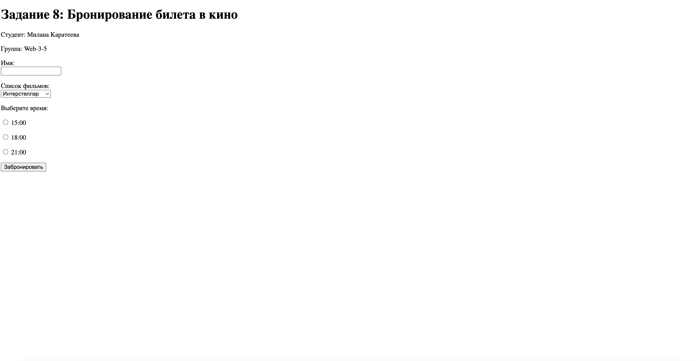
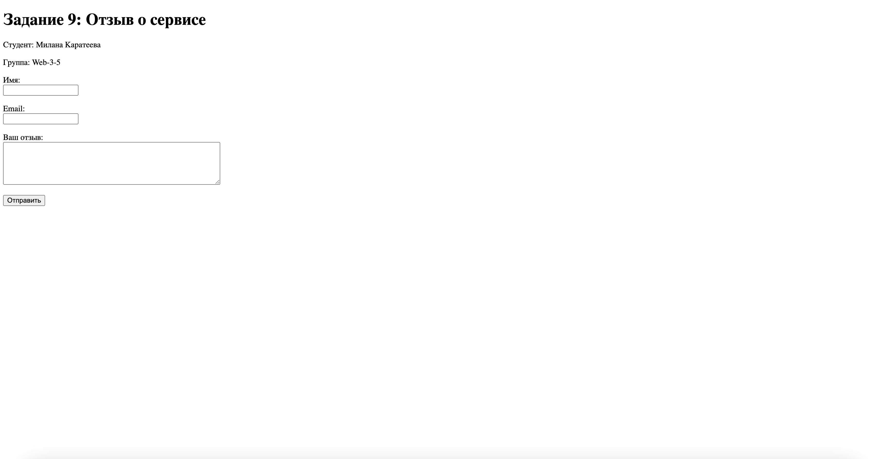
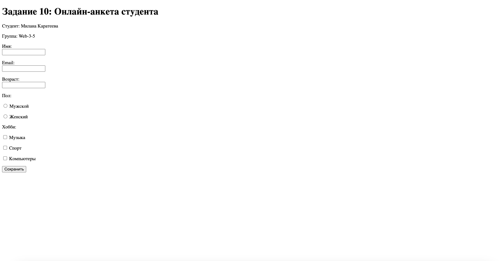

# HTML Формы - Задания от 17 сентября

Выполнила: Милана Каратеева  
Колледж: Алматинский экономический колледж, группа Web-3-5

## Задание 1: Форма входа
Файл: [task1.html](./task1.html)  
Результат: 

## Задание 2: Регистрация пользователя
Файл: [task2.html](./task2.html)  
Результат: 

## Задание 3: Подписка на новости
Файл: [task3.html](./task3.html)  
Результат: 

## Задание 4: Опрос о любимом цвете
Файл: [task4.html](./task4.html)  
Результат: 

## Задание 5: Выбор интересов
Файл: [task5.html](./task5.html)  
Результат: 

## Задание 6: Заказ еды онлайн
Файл: [task6.html](./task6.html)  
Результат: 

## Задание 7: Выбор города
Файл: [task7.html](./task7.html)  
Результат: 

## Задание 8: Бронирование билета в кино
Файл: [task8.html](./task8.html)  
Результат: 

## Задание 9: Отзыв о сервисе
Файл: [task9.html](./task9.html)  
Результат: 

## Задание 10: Онлайн-анкета студента
Файл: [task10.html](./task10.html)  
Результат: 
