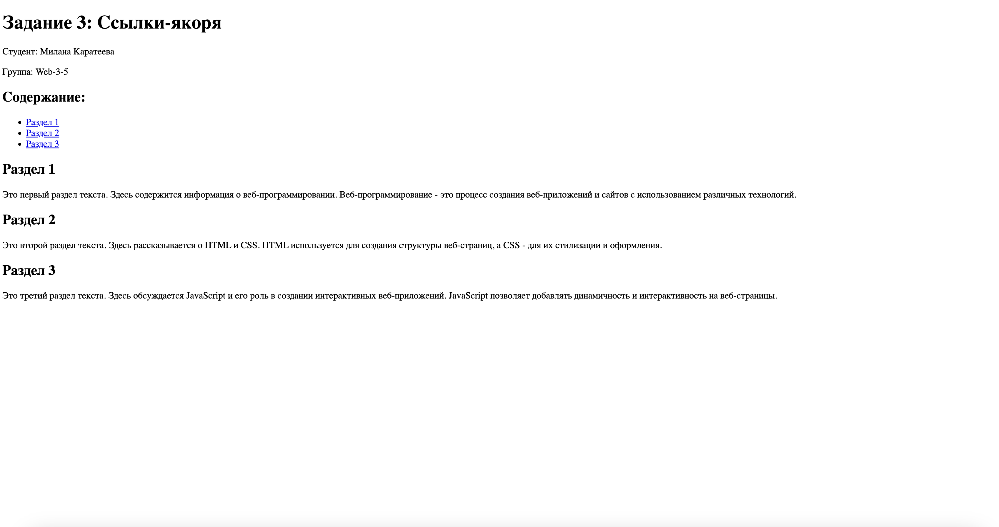

# HTML Ссылки и формы - Задания от 19 сентября

Выполнила: Милана Каратеева  
Колледж: Алматинский экономический колледж, группа Web-3-5

## Задание 1: Простая ссылка
Файл: [task1.html](./task1.html)  
Результат: 

## Задание 2: Несколько ссылок-меню
Файл: [task2.html](./task2.html)  
Результат: 

## Задание 3: Ссылки-якоря
Файл: [task3.html](./task3.html)  
Результат: 

## Задание 4: Внешняя ссылка с иконкой
Файл: [task4.html](./task4.html)  
Результат: 

## Задание 5: Стилизация ссылок
Файл: [task5.html](./task5.html)  
Результат: 

## Задание 6: Форма регистрации
Файл: [task6.html](./task6.html)  
Результат: 

## Задание 7: Поле с ограничением символов
Файл: [task7.html](./task7.html)  
Результат: 

## Задание 8: Ввод возраста
Файл: [task8.html](./task8.html)  
Результат: 

## Задание 9: Ввод телефона по шаблону
Файл: [task9.html](./task9.html)  
Результат: 

## Задание 10: Форма с датой рождения
Файл: [task10.html](./task10.html)  
Результат: 
