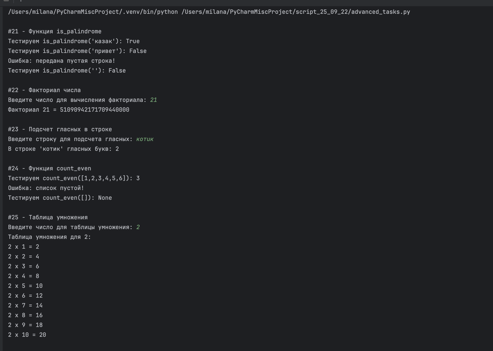

# Задания от 22 сентября

Выполнила: Милана Каратеева  
Колледж: Алматинский экономический колледж, группа Web-3-5

## Простые задания (1-10)
Файл: [simple_tasks.py](./simple_tasks.py)


## Средние задания (11-20)
Файл: [medium_tasks.py](./medium_tasks.py)


## Продвинутые задания (21-30)
Файл: [advanced_tasks.py](./advanced_tasks.py)




### Запуск заданий:
```bash
python ./simple_tasks.py
python ./medium_tasks.py  
python ./advanced_tasks.py
```
