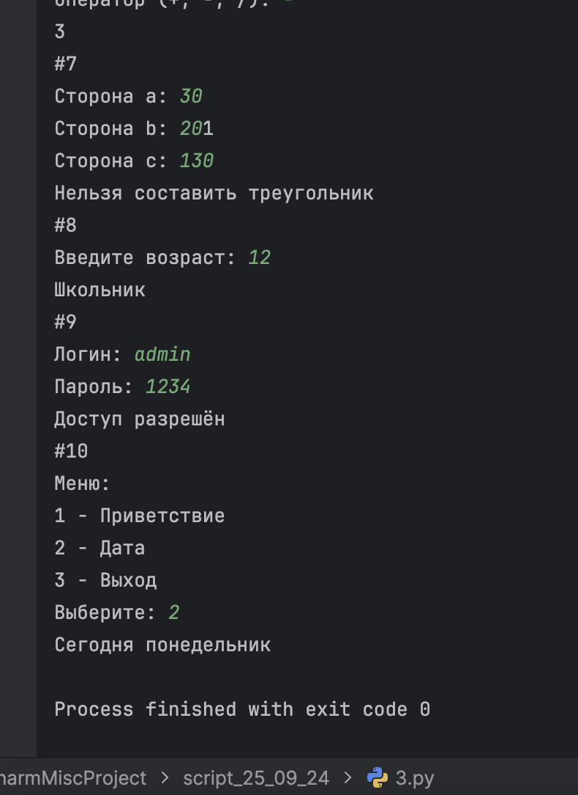

# Задания от 24 сентября

Выполнила: Милана Каратеева  
Колледж: Алматинский экономический колледж, группа Web-3-5

## Базовые задания (1-10)
Файл: [script1.py](./script1.py)


## Задания с условиями (11-20)
Файл: [script2.py](./script2.py)


## Задания с циклами (21-30)
Файл: [script3.py](./script3.py)




## Задания с функциями (31-40)
Файл: [script4.py](./script4.py)


## Задания с массивами (41-50)
Файл: [script5.py](./script5.py)


## Задания с обработкой ошибок (51-60)
Файл: [script6.py](./script6.py)


## Дополнительные задания (61-70)
Файл: [script7.py](./script7.py)


### Запуск заданий:
```bash
python ./script1.py
python ./script2.py
python ./script3.py
python ./script4.py
python ./script5.py
python ./script6.py
python ./script7.py
```
