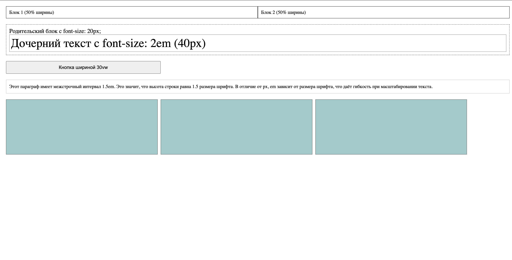
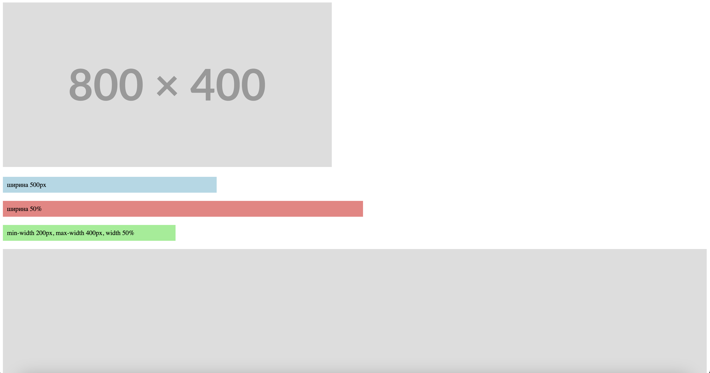
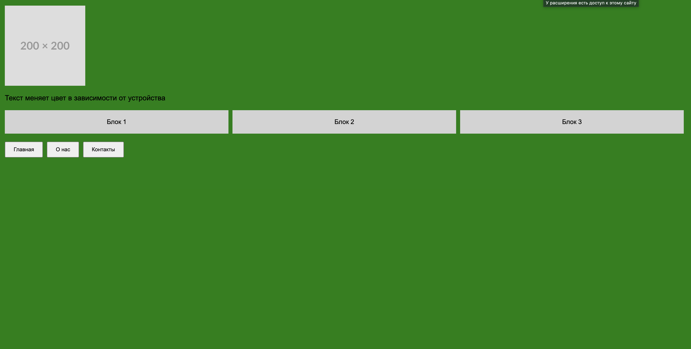
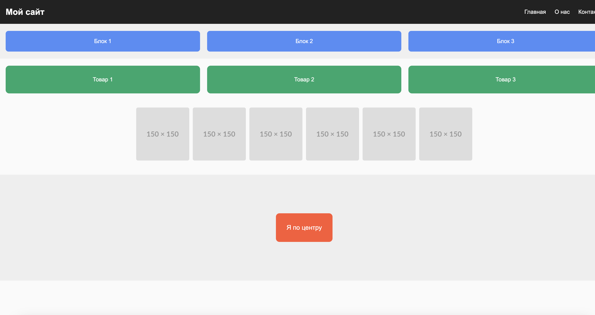
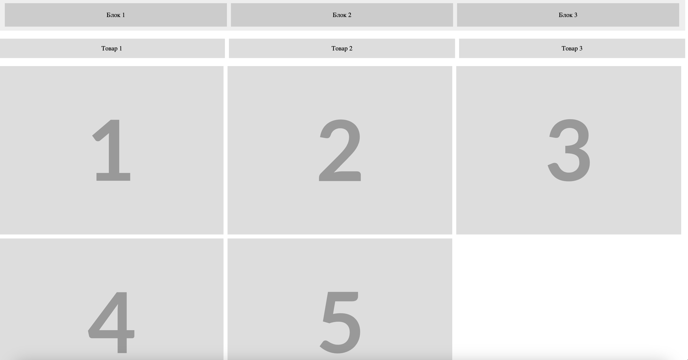
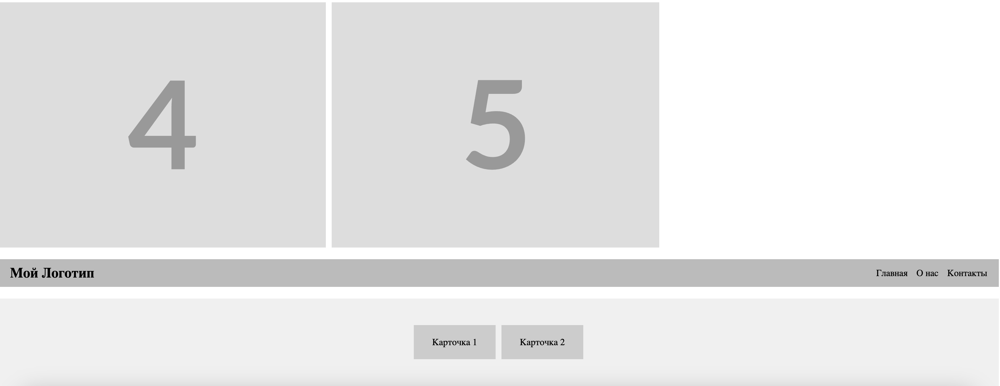
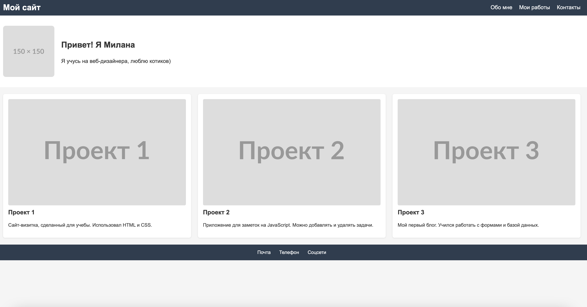

# Задания от 25 сентября

Выполнила: Милана Каратеева  
Колледж: Алматинский экономический колледж, группа Web-3-5

## Задание 1 - Относительные единицы измерения
Файл: [task1.html](./task1.html)



## Задание 2 - Изображения и блоки
Файл: [task2.html](./task2.html)



## Задание 3 - Медиа-запросы
Файл: [task3.html](./task3.html)



## Задание 4 - Flexbox пример
Файл: [task4.html](./task4.html)



## Задание 5 - Flexbox задачи
Файл: [task5.html](./task5.html)




## Задание 6 - Сайт-визитка
Файл: [task6.html](./task6.html)



### Запуск заданий:
```bash
# Откройте HTML файлы в браузере
open ./task1.html
open ./task2.html
open ./task3.html
open ./task4.html
open ./task5.html
open ./task6.html
```
