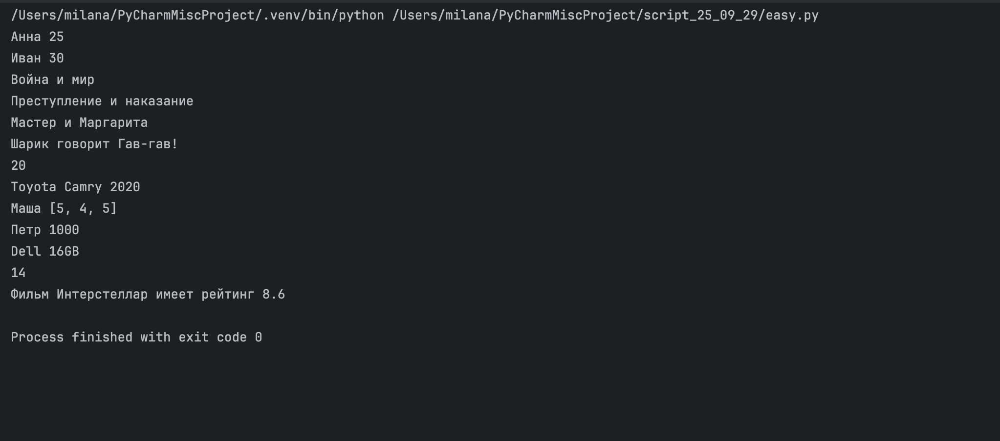
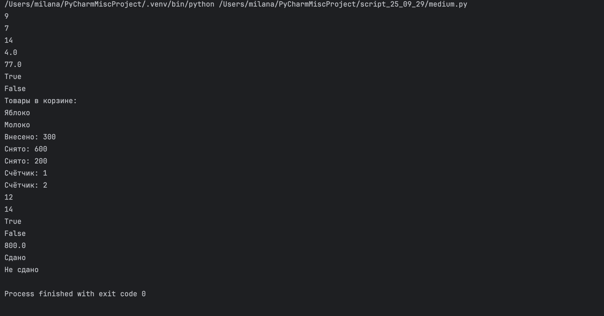
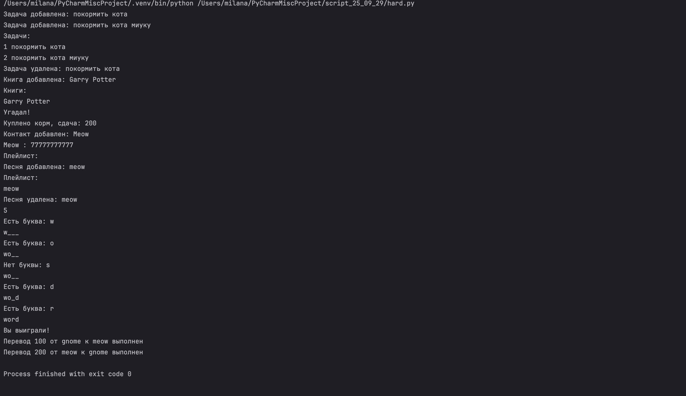

# Задания от 29 сентября

Выполнила: Милана Каратеева  
Колледж: Алматинский экономический колледж, группа Web-3-5

## Легкие задания (1-10)
Файл: [easy.py](./easy.py)



## Средние задания (11-20)
Файл: [medium.py](./medium.py)



## Сложные задания (21-30)
Файл: [hard.py](./hard.py)



### Запуск заданий:
```bash
python ./easy.py
python ./medium.py
python ./hard.py
```
