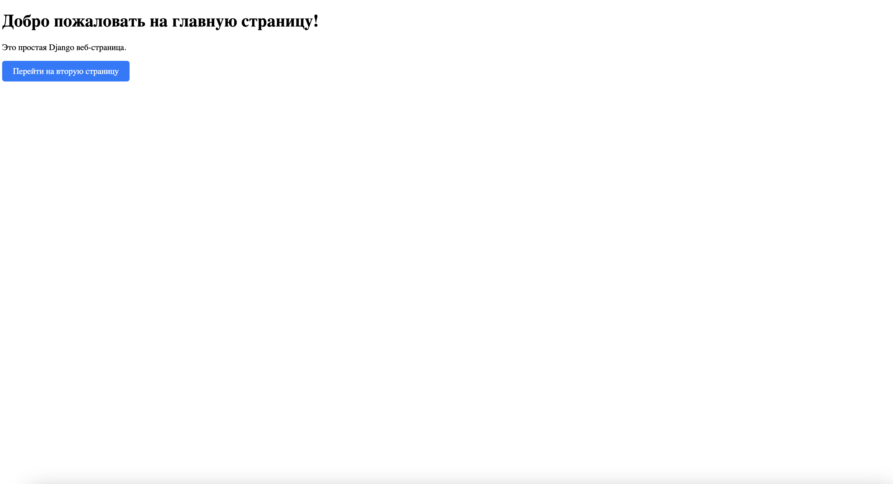

# Задания от 3 октября

Выполнила: Милана Каратеева  
Колледж: Алматинский экономический колледж, группа Web-3-5

## Django проект - Мой сайт
### Описание проекта:
Простой Django веб-сайт с двумя страницами:
- Главная страница с приветствием
- Вторая страница с навигацией




### Запуск проекта:
```bash
cd mysite
python manage.py runserver
```
