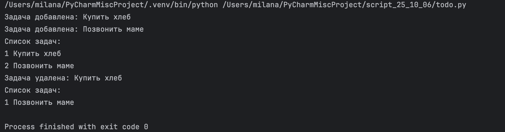

# Задания от 6 октября

Выполнила: Милана Каратеева  
Колледж: Алматинский экономический колледж, группа Web-3-5

## Задания по инкапсуляции (1-10)
Файл: [script1.py](./script1.py)


## Задания по наследованию (11-20)
Файл: [script2.py](./script2.py)


## Задания по полиморфизму (21-30)
Файл: [script3.py](./script3.py)


## Задания по композиции (31-40)
Файл: [script4.py](./script4.py)



### Запуск заданий:
```bash
python ./script1.py
python ./script2.py
python ./script3.py
python ./script4.py
```
