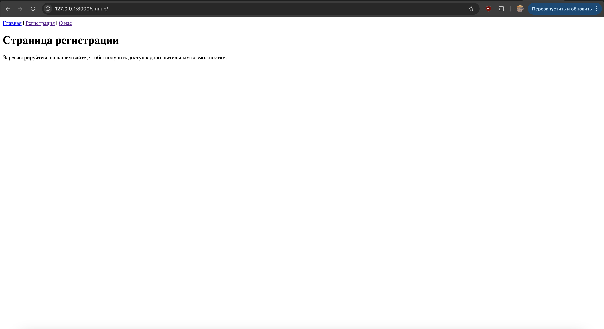

# Задания от 7 октября

Выполнила: Милана Каратеева  
Колледж: Алматинский экономический колледж, группа Web-3-5

## Django проект 1 - DiasDjangoProject
Папка: [DiasDjangoProject/](./DiasDjangoProject/)

### Описание проекта:
Простой Django сайт с двумя страницами:
- Главная страница (hello/)
- Страница регистрации (signup/)


## Django проект 2 - Minisite
Папка: [minisite/](./minisite/)

### Описание проекта:
Многостраничный Django сайт с навигацией:
- Главная страница (hello/)
- Страница регистрации (signup/)
- Страница "О нас" (about/)





### Запуск проектов:
```bash
# Запуск minisite
cd minisite
python manage.py runserver

# Запуск DiasDjangoProject
cd DiasDjangoProject
python manage.py runserver
```

После запуска серверов сайты будут доступны по адресу: http://127.0.0.1:8000/
