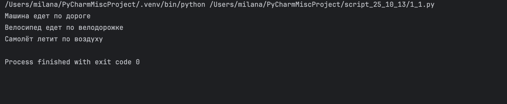
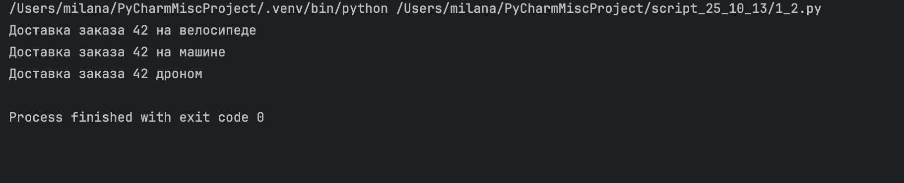
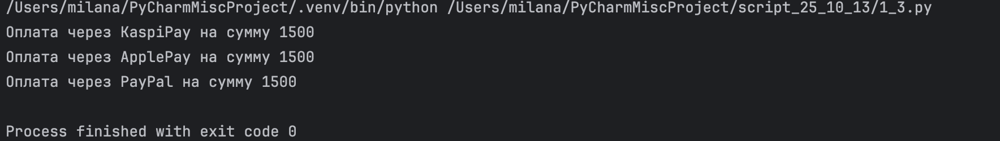
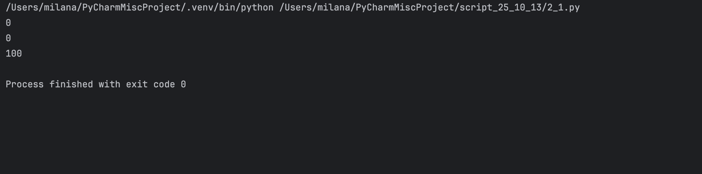
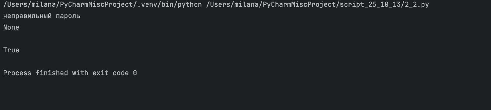
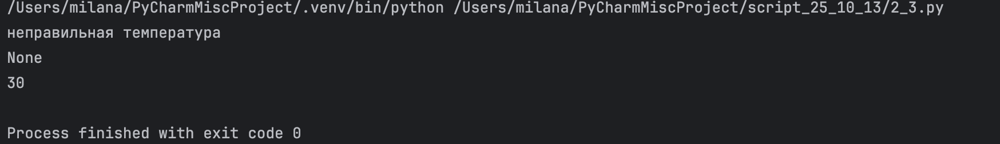
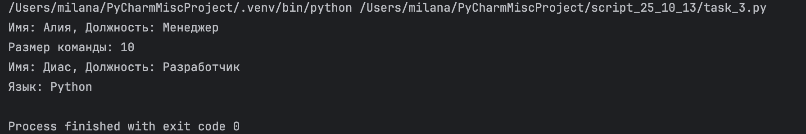
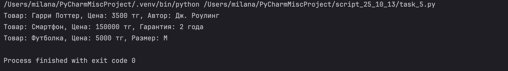
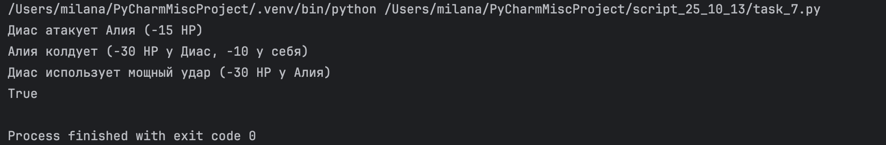

# Задания от 13 октября

Выполнила: Милана Каратеева  
Колледж: Алматинский экономический колледж, группа Web-3-5

## Задание 1 - Полиморфизм с транспортом
Файл: [script1.py](./script1.py)



## Задание 2 - Полиморфизм с курьерами
Файл: [script2.py](./script2.py)



## Задание 3 - Полиморфизм с платежными системами
Файл: [script3.py](./script3.py)



## Задание 4 - Обработка исключений в банковском счете
Файл: [script4.py](./script4.py)



## Задание 5 - Валидация пароля
Файл: [script5.py](./script5.py)



## Задание 6 - Валидация температуры термостата
Файл: [script6.py](./script6.py)



## Задание 7 - Наследование сотрудников
Файл: [script7.py](./script7.py)



## Задание 8 - Наследование товаров
Файл: [script8.py](./script8.py)



## Задание 9 - Игровые персонажи
Файл: [script9.py](./script9.py)



### Запуск заданий:
```bash
python ./script1.py
python ./script2.py
python ./script3.py
python ./script4.py
python ./script5.py
python ./script6.py
python ./script7.py
python ./script8.py
python ./script9.py
```
