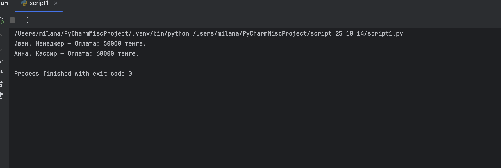
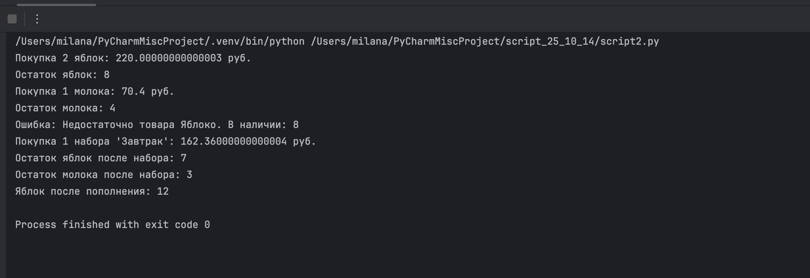
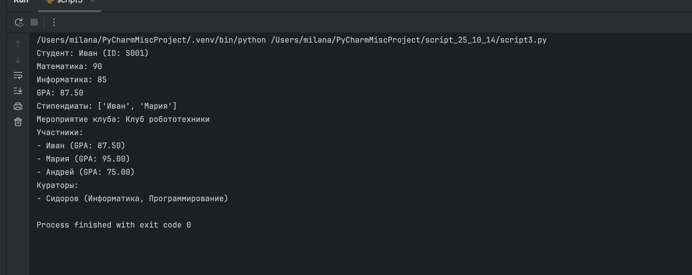

# Задания от 14 октября

Выполнила: Милана Каратеева  
Колледж: Алматинский экономический колледж, группа Web-3-5

## Задание 1 - Абстрактные классы сотрудников
Файл: [script1.py](./script1.py)



## Задание 2 - Система управления товарами
Файл: [script2.py](./script2.py)



## Задание 3 - Система управления колледжем
Файл: [script3.py](./script3.py)



### Запуск заданий:
```bash
python ./script1.py
python ./script2.py
python ./script3.py
```
