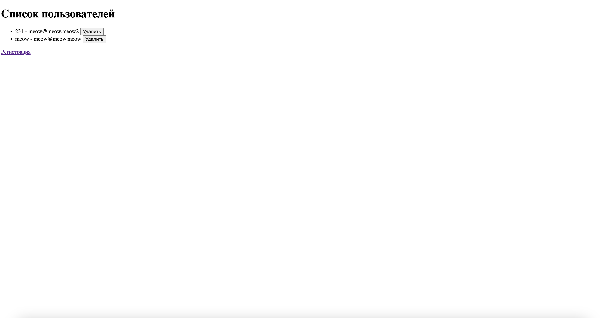

# Задания от 16 октября

Выполнила: Милана Каратеева  
Колледж: Алматинский экономический колледж, группа Web-3-5

## Django проект - Система регистрации пользователей
Папка: [task_25_10_16/](./task_25_10_16/)

### Описание проекта:
Django веб-приложение для регистрации и управления пользователями:
- Форма регистрации с валидацией
- Страница успешной регистрации
- Список всех пользователей
- Возможность удаления пользователей





### Запуск проекта:
```bash
cd task_25_10_16
python manage.py runserver
```

После запуска сервера сайт будет доступен по адресу: http://127.0.0.1:8000/
