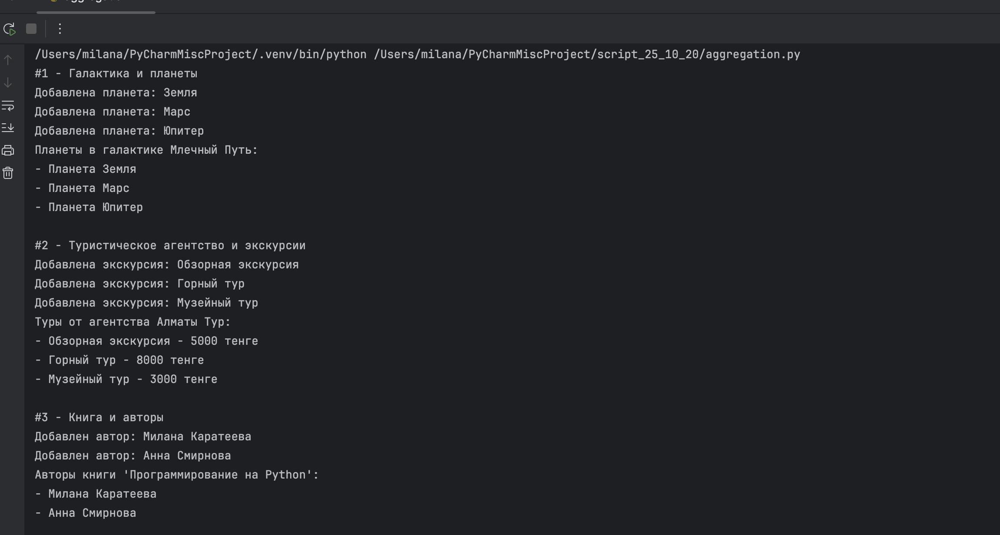
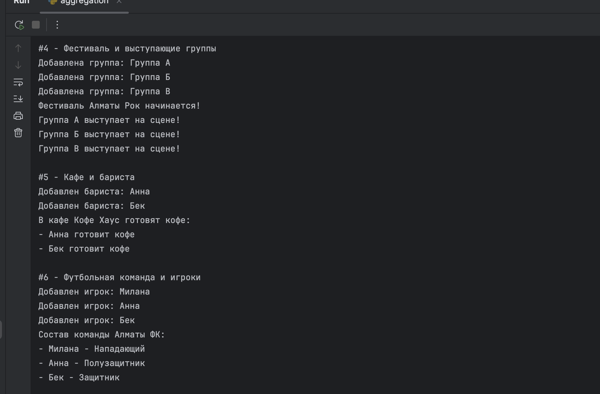
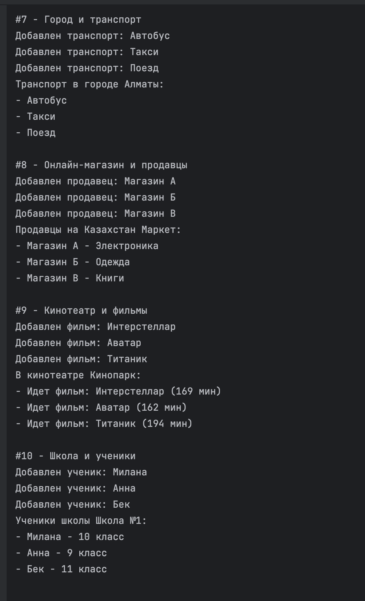
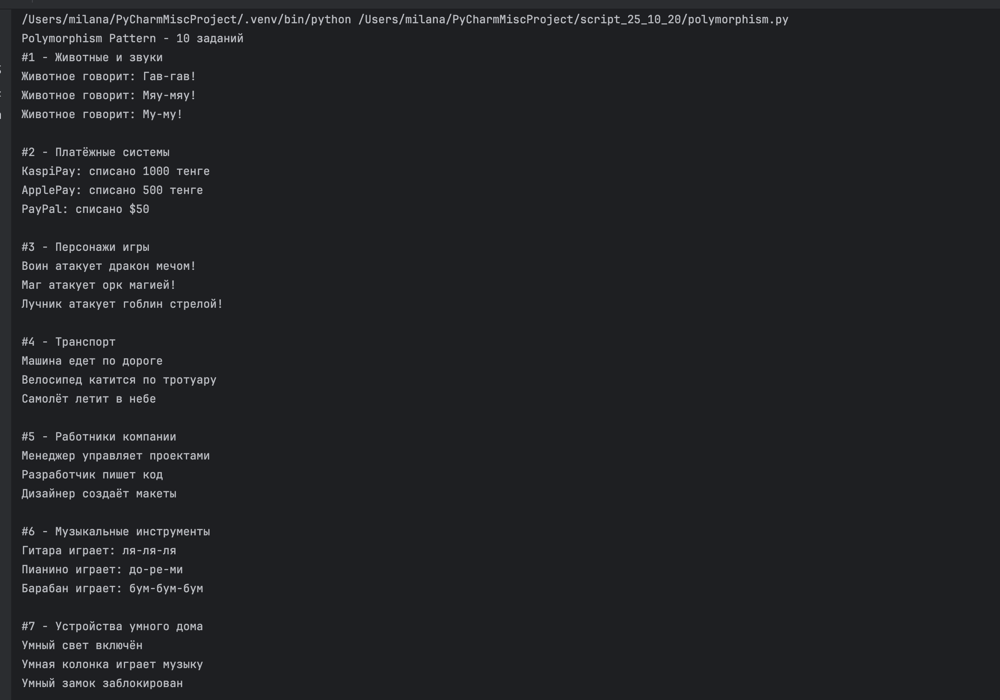
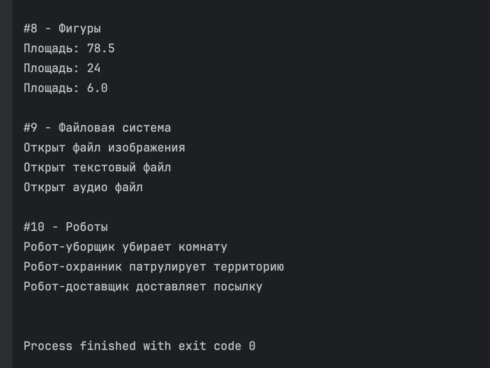

# Задание от 20 октября

Выполнила: Милана Каратеева  
Колледж: Алматинский экономический колледж, группа Web-3-5

### Aggregation Pattern
Файл: [Aggregation.py](./Aggregation.py)





### Polymorphism Pattern
Файл: [Polymorphism.py](./Polymorphism.py)





```bash
python ./Aggregation.py
python ./Polymorphism.py
```
