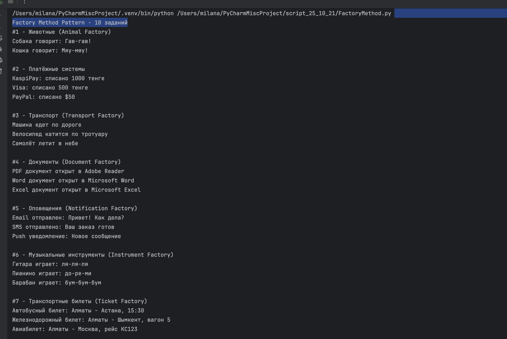
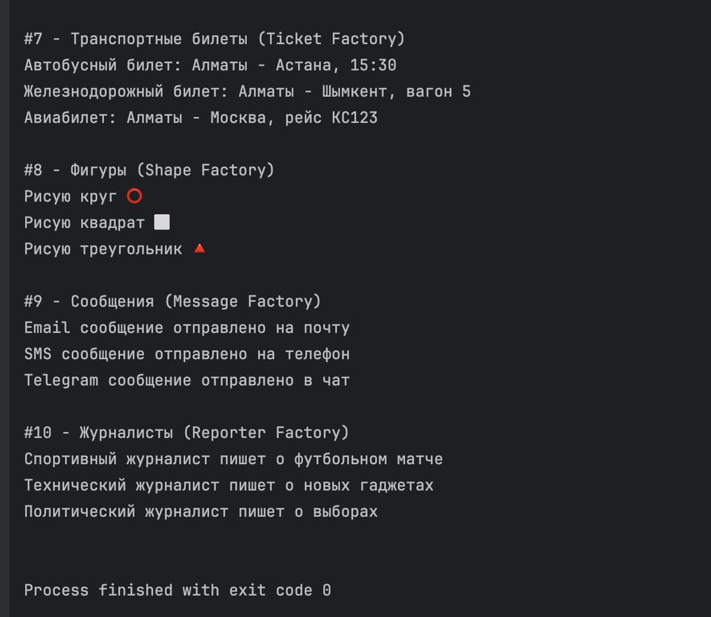
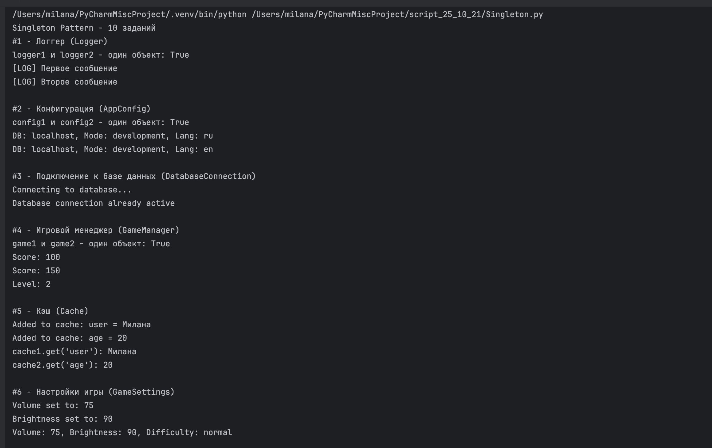
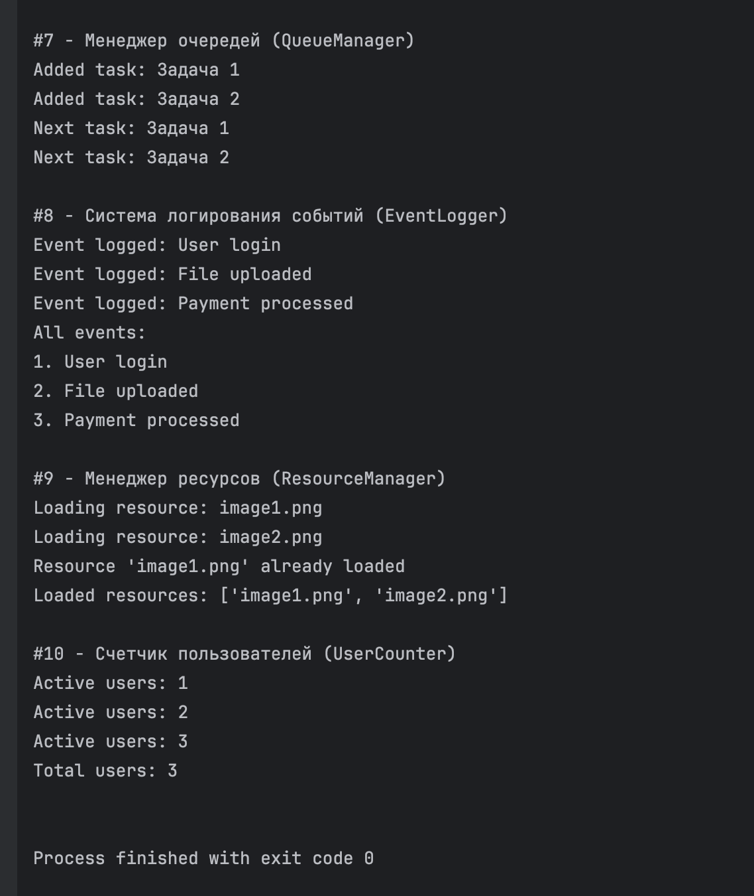

# Паттерны проектирования - Factory Method и Singleton от 21 октября

Выполнила: Милана Каратеева  
Колледж: Алматинский экономический колледж, группа Web-3-5

### Factory Method Pattern
Файл: [FactoryMethod.py](./FactoryMethod.py)

**Результаты выполнения:**





### Singleton Pattern
Файл: [Singleton.py](./Singleton.py)

**Результаты выполнения:**





```bash
python ./FactoryMethod.py
python ./Singleton.py
```

