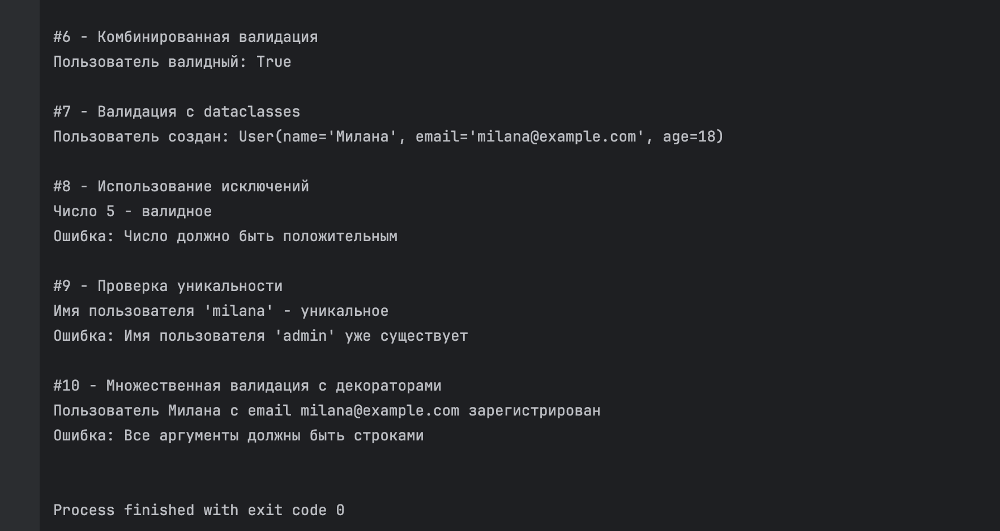
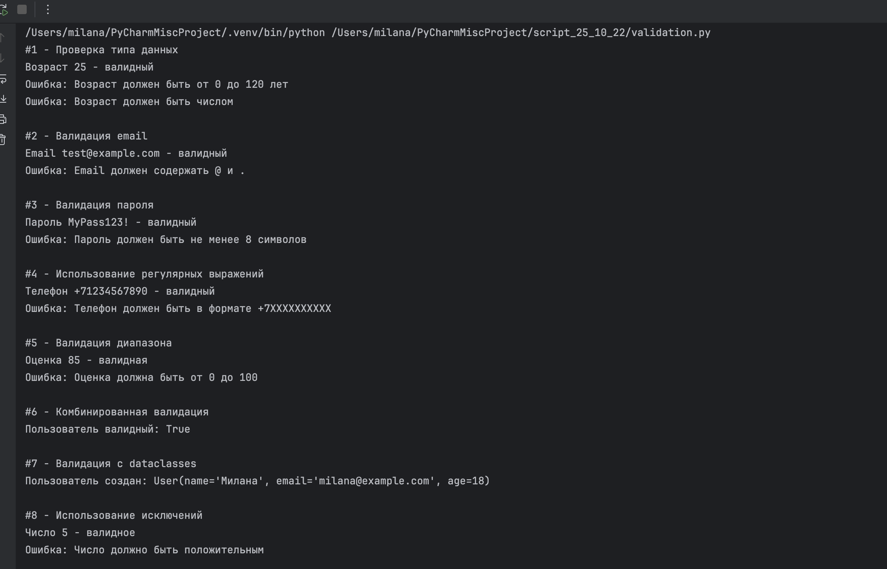
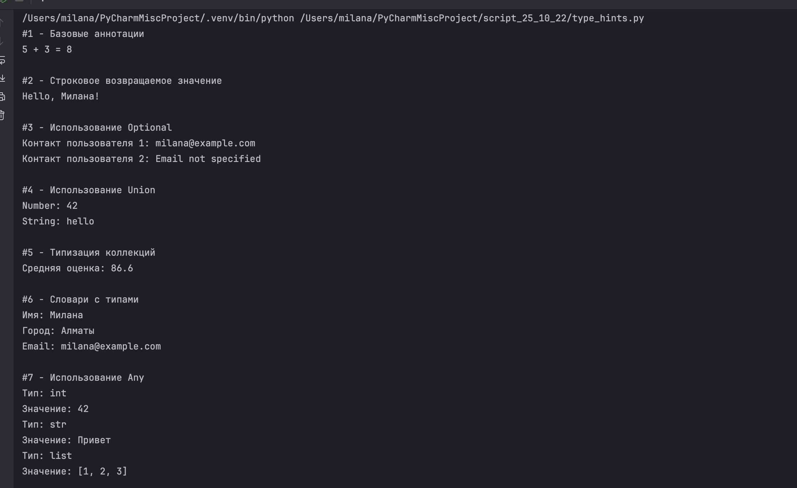
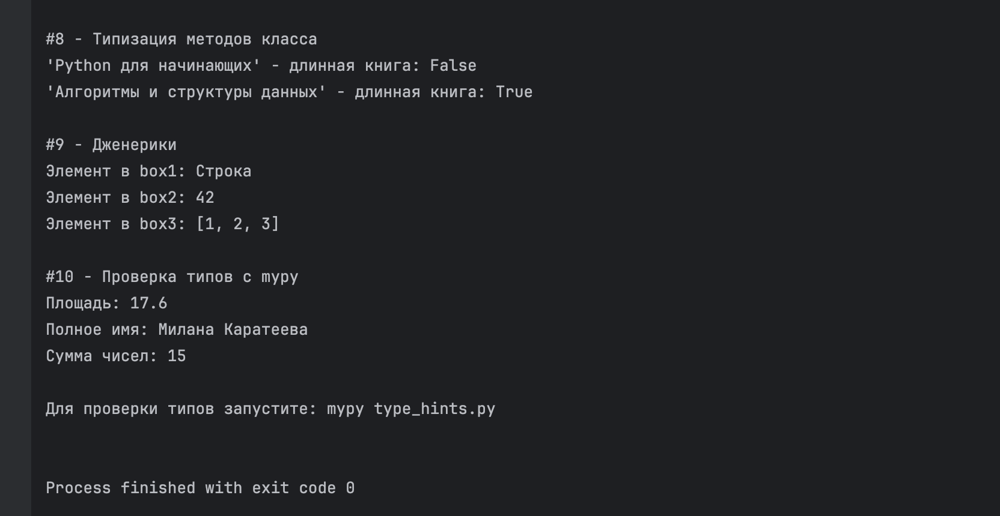
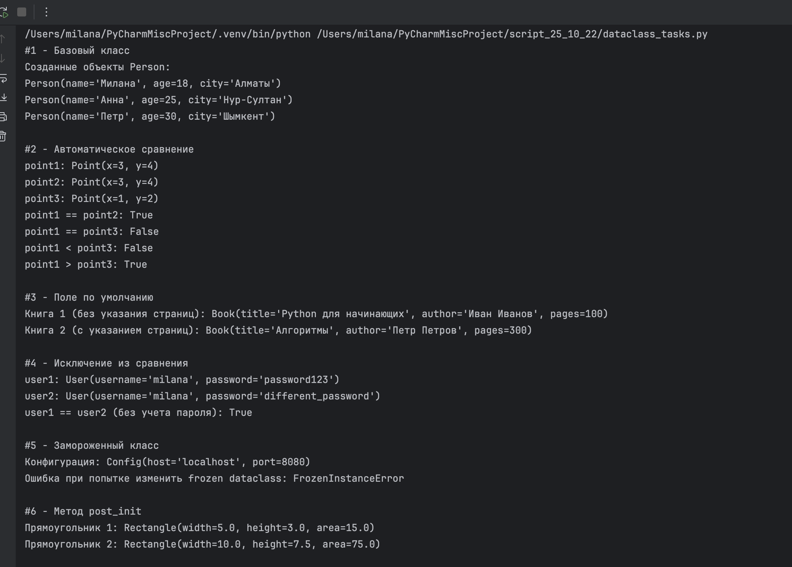
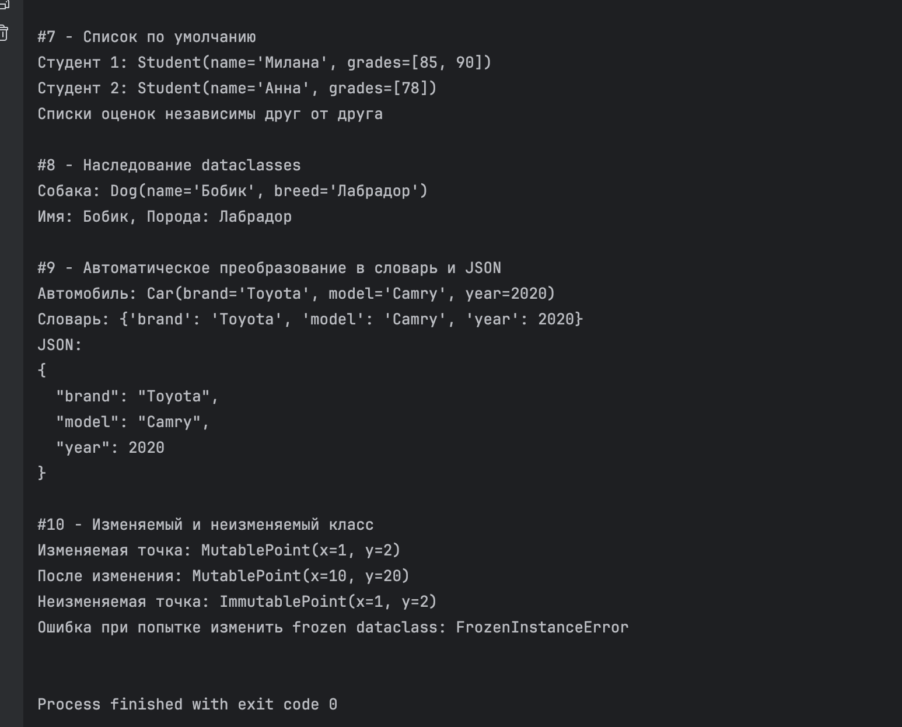

# Валидация, типизация и dataclasses от 22 октября

Выполнила: Милана Каратеева  
Колледж: Алматинский экономический колледж, группа Web-3-5

### ВАЛИДАЦИЯ ДАННЫХ
Файл: [validation.py](validation.py)



### ТИПИЗАЦИЯ
Файл: [type_hints.py](type_hints.py)



### DATACLASSES
Файл: [dataclass_tasks.py](dataclass_tasks.py)



```bash
python ./validation.py
python ./type_hints.py
python ./dataclass_tasks.py
```
