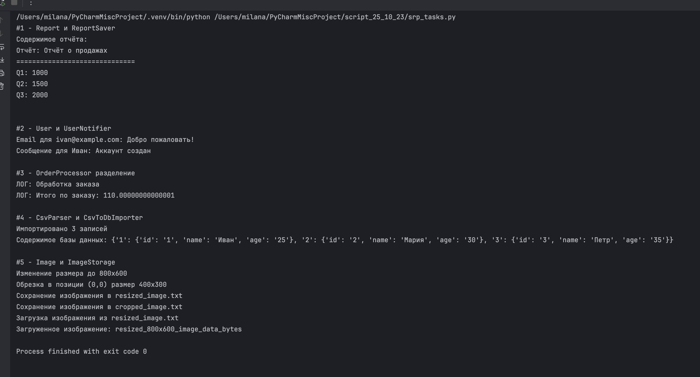
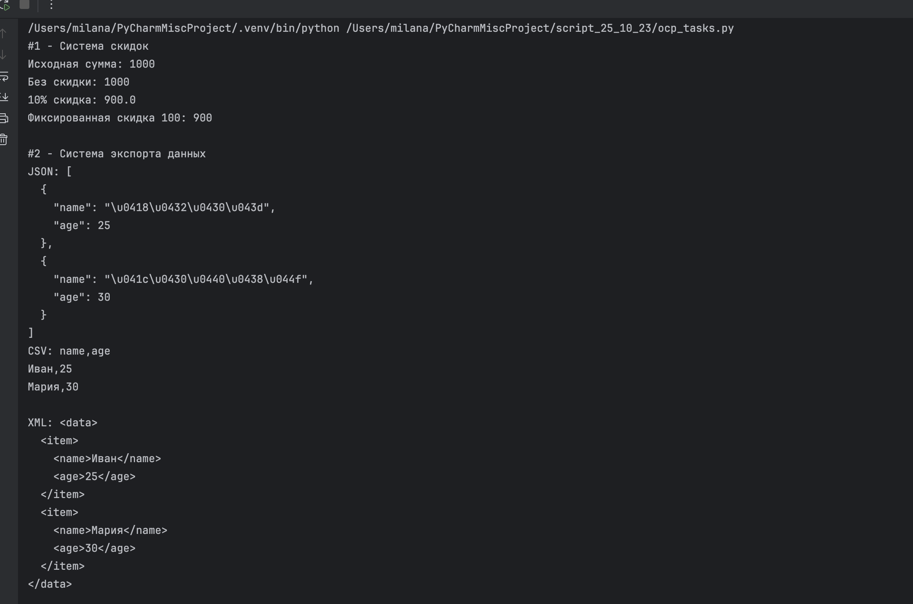
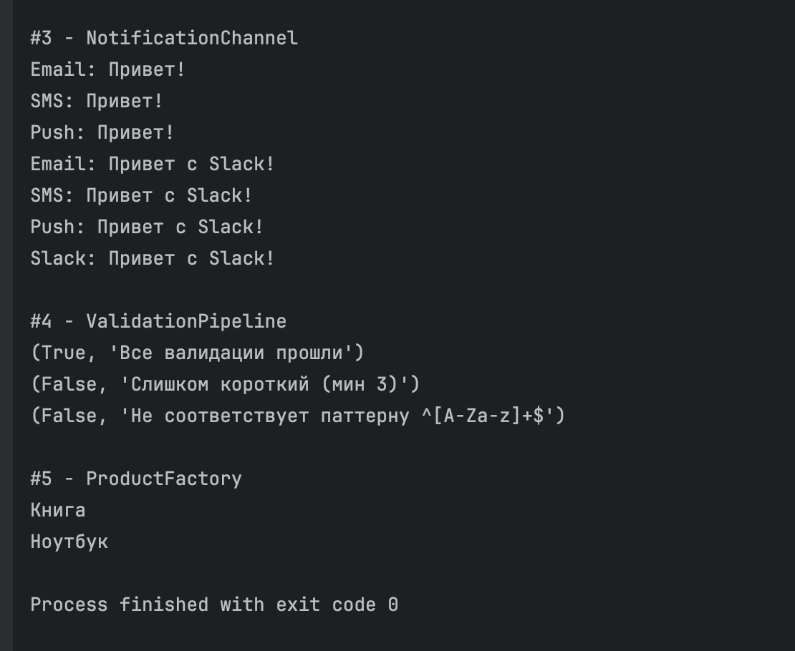
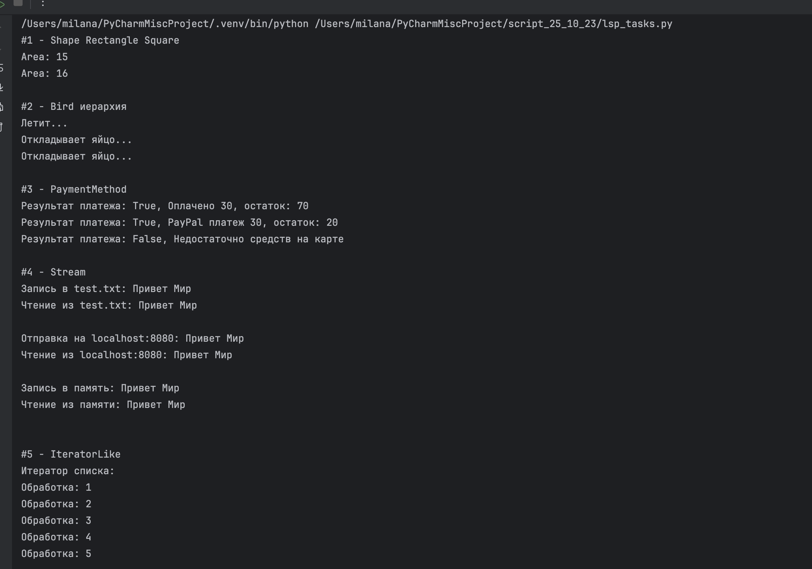
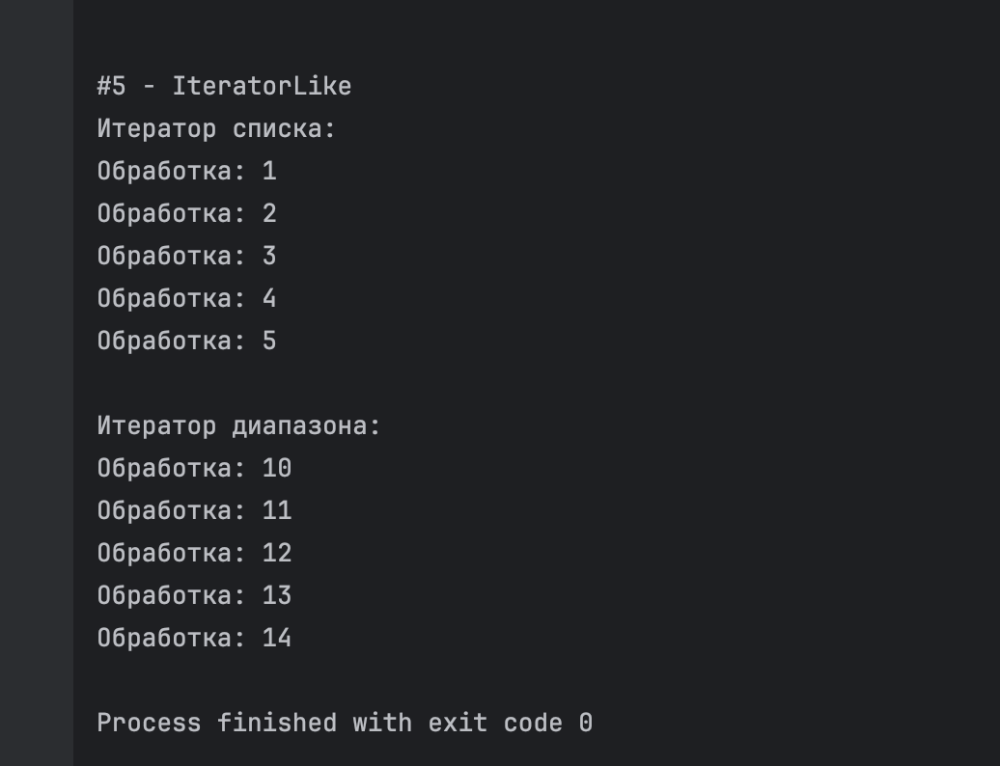
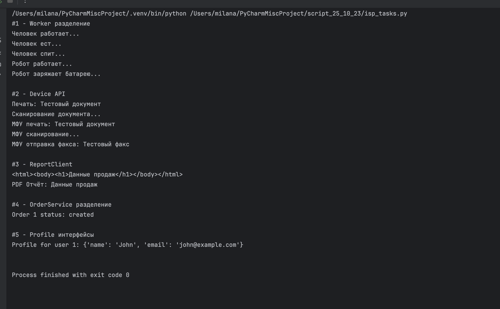
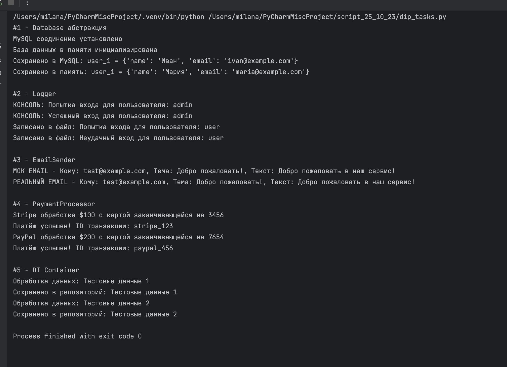

# SOLID - Задания от 23 октября

Выполнила: Милана Каратеева  
Колледж: Алматинский экономический колледж, группа Web-3-5

### SRP - Single Responsibility Principle
Файл: [srp_tasks.py](srp_tasks.py)


### OCP - Open/Closed Principle
Файл: [ocp_tasks.py](ocp_tasks.py)



### LSP - Liskov Substitution Principle
Файл: [lsp_tasks.py](lsp_tasks.py)



### ISP - Interface Segregation Principle
Файл: [isp_tasks.py](isp_tasks.py)


### DIP - Dependency Inversion Principle
Файл: [dip_tasks.py](dip_tasks.py)


```bash
python ./srp_tasks.py
python ./ocp_tasks.py
python ./lsp_tasks.py
python ./isp_tasks.py
python ./dip_tasks.py
```
